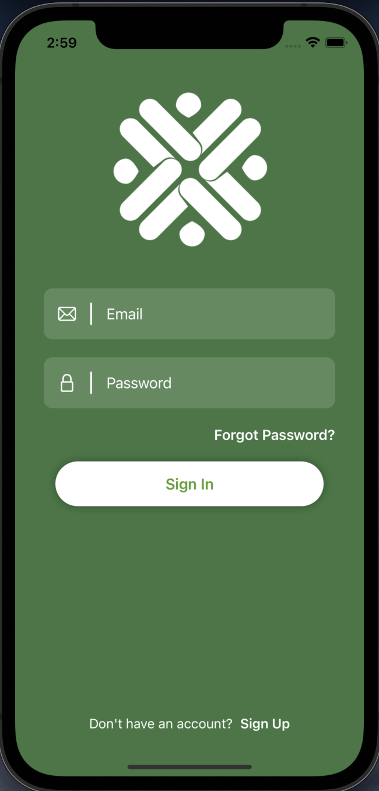
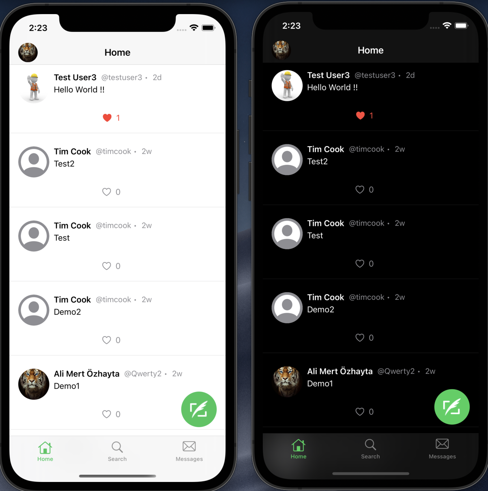
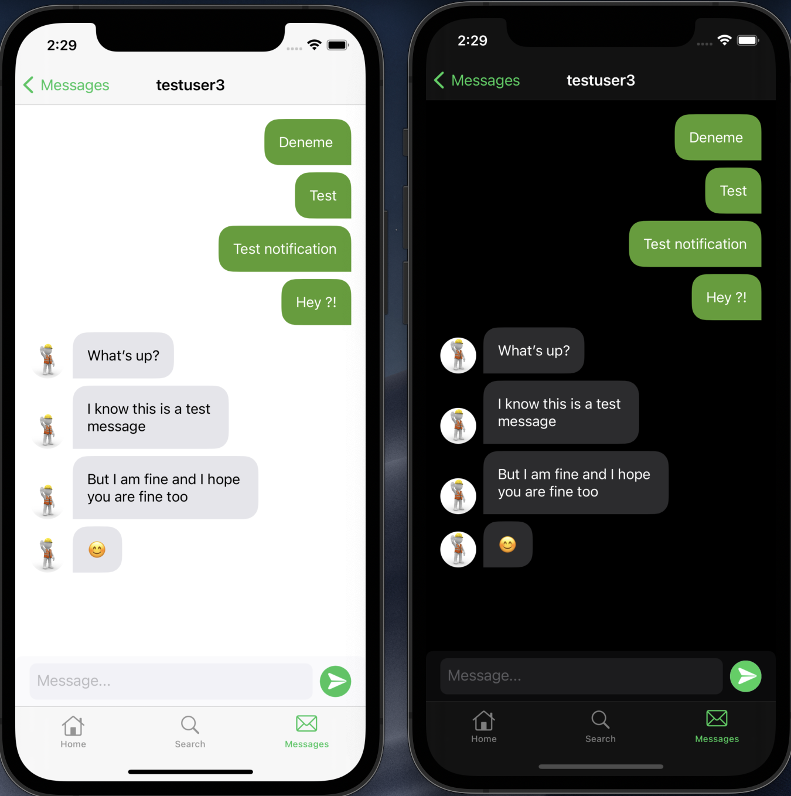
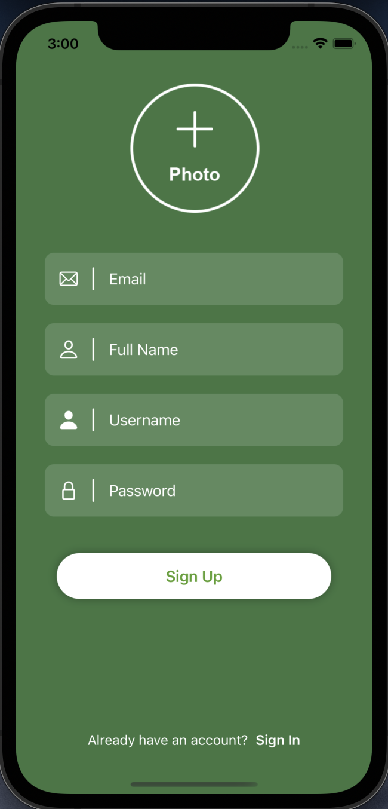
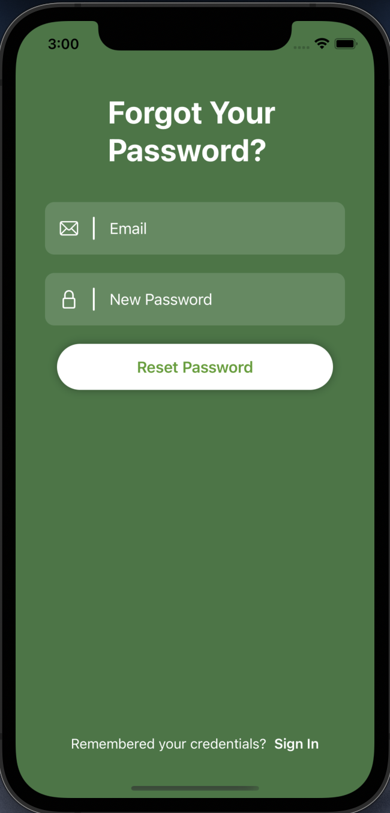
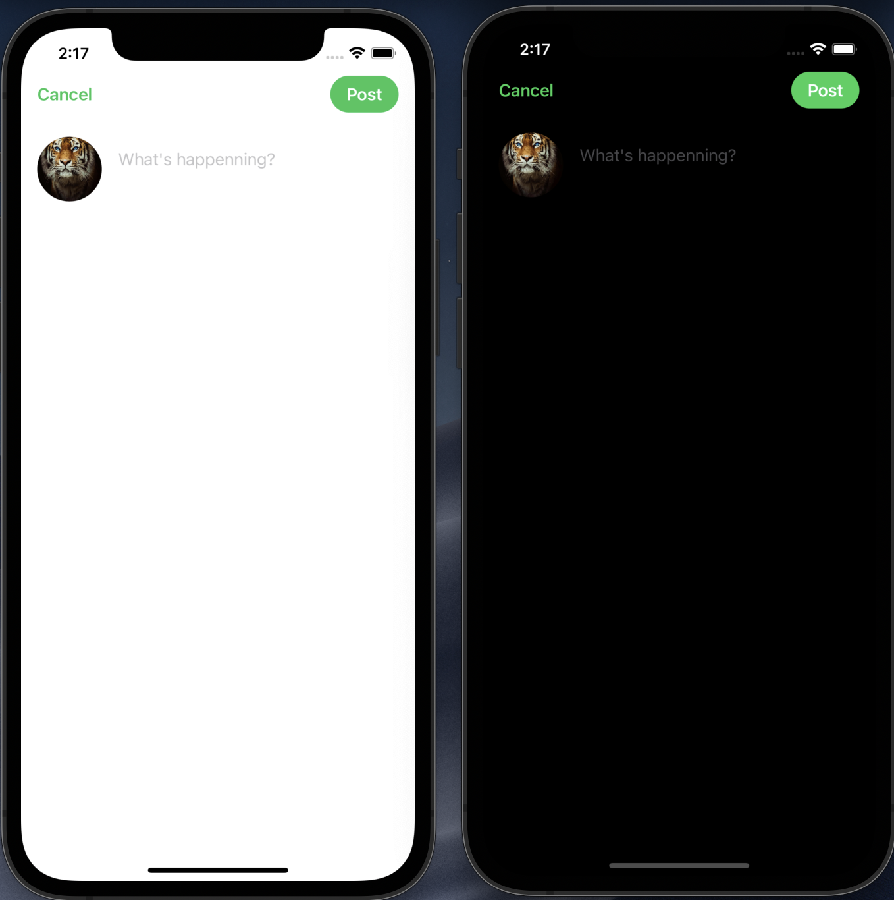
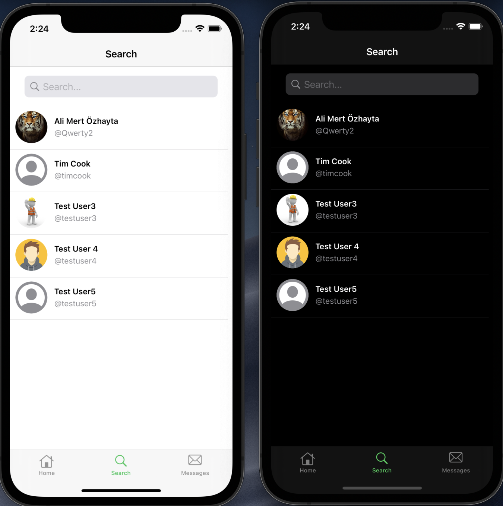
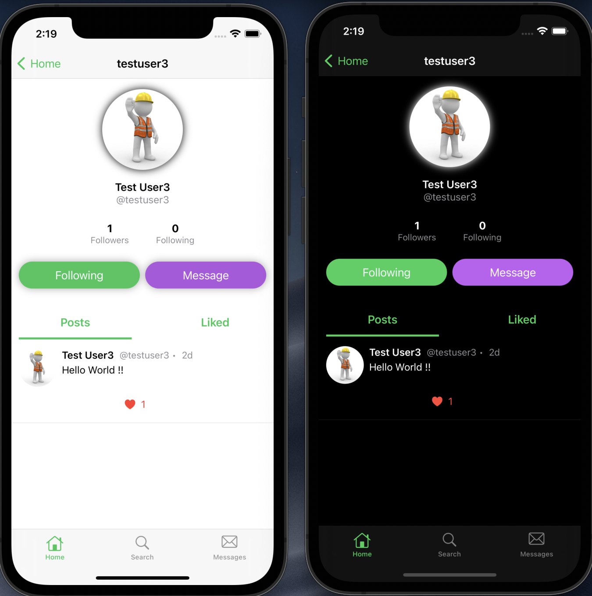
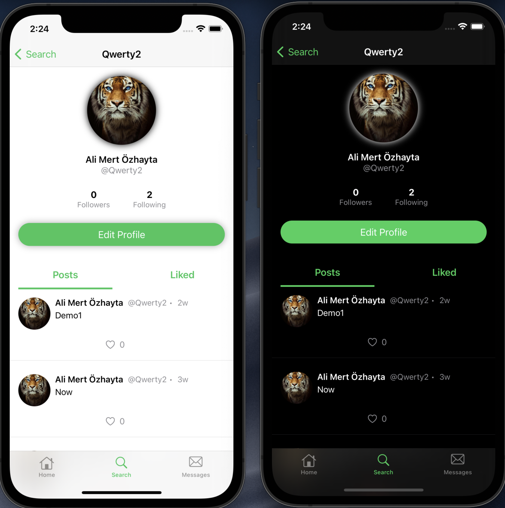
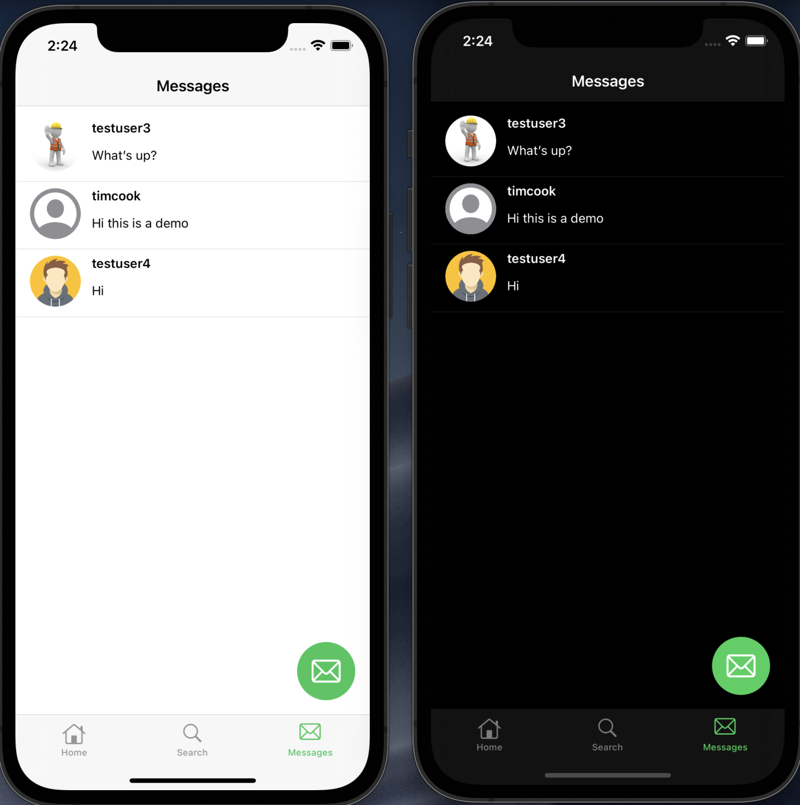

## HiPlace - iOS

## Table of Contents

 * [Introduction](#introduction)
 * [HMS Services](#hms-services)
 * [Getting Started](#getting-started)
 * [Supported Environments](#supported-environments)
 * [Installation](#installation)
 * [Screenshots](#screenshots)
 
 

## Introduction

HiPlace is a Twitter like social media app that users can share their moments, follow other users and can send direct messages privately.

* User can easily log in to the app from the registration screen or quickly log in to the app with Huawei Id.
* You can access posts of users on the Home Tab. 
* On the Search Tab, you can find new users based on name or username.
* When user presses the profile photo of the post's owner on the Home Tab or Search Tab, profile page of the user opens and you can follow/unfollow the person or send a direct message to the user.
*  On the Messages Tab, you can see and reply your conversations. With direct messaging, you can send messages to other users to have a private conversation.
 
This project is developed by using <b>SwiftUI 2.0</b>.
 

<table width=1300>
  <tr>
    <td>
   
</td>
  <td>   
    
</td>
      <td>   
    
</td>
  </tr>
</table>

 

## HMS Services

* <h3><u>Auth Service</u></h3>  
  Auth Service is used for creating a new account, loggin in and resetting password.
  
* <h3><u>CloudDB</u></h3>  
  All posts, messages and user profile information are stored in CloudDB.

  CloudDB is the main and the only database of HiPlace app.

* <h3><u>Cloud Functions</u></h3>  
  
   Instead of requesting multiple queries (on CloudDB) and collecting different query results consecutively on the client, Cloud Functions is used to collect necessary data and return it to client with single request. 
   
   This was possible  by integrating CloudDB  on Cloud Functions.
   
* <h3><u>Push Kit</u></h3>  
   When a user sends direct message, push kit is used to notify the other user.
   
     Notification Title: Full name of the user
   
     Notification Body: Message
  
* <h3>Analytics</h3>  

* <h3>Crash</h3>  

   
## Getting Started

* You need to import <b>agconnect-services.plist</b> file to run the project correctly.
* If you don't have a Huawei Developer account, check <a href="https://developer.huawei.com/consumer/en/doc/start/10104" target="_blank">this document</a> to create a new one.
* <a href="https://developer.huawei.com/consumer/en/console" target="_blank">Login</a> to Huawei Developer Console.
* If you don't have a project and app, check <a href="https://developer.huawei.com/consumer/en/doc/distribution/app/agc-create_app" target="_blank">this document</a> to learn how to create.
* Go to <b>My Projects</b> and select your project that you were created. And click <b>Project Settings</b> then go to <b>Manage APIs</b> page to nable necessary SDKs.
* For this project you need to set enable Auth Service, Push Kit and HUAWEI Analytics.
* Now your app can use the enabled services APIs but also, you need to enable following services for your project as well: 

  -- Auth Service

  -- CloudDB

  -- Cloud Functions

  -- Push

  -- Analytics

* For CloudDB Object Types, you can have a look at the following path: HiPlace/Utils/CloudDbHelpers/ObjectTypes
* Then return to <b>Project Settings</b> page and download <b>agconnect-services.plist</b> file.
* Move the configuration file into your project, below Info.plist file.

 

## Supported Environments

* You need a Mac with Xcode 11 or later installed.
* You need Cocoapods to install libraries.

 

## Installation

To integrate HMS Services, you must complete the following preparations:
*   Create a SwiftUI project.
*   Create the Podfile, and add necessary framework(s).
 
Edit the Podfile.
Add the following <b>pods</b> to your pod file:
 

    <b> pod 'AGConnectCore'
    pod 'HiAnalytics'
    pod 'AGConnectCrash'
    pod 'AGConnectAuth'
    pod 'AGConnectDatabase'
    pod 'AGConnectFunction'
    pod 'HmsPushSDK' </b>
   
  // third party pod
  //  for downloading photos asynchronously
<b>  pod 'Kingfisher' </b>
 

And run `pod install` command.

 
 

## Screenshots
<table  width= 700>
  <tr>
<td >
   
</td>
  <td>   
    
</td>
    <td>   
    
</td>
  </tr>
  </table>
  
  <table width= 1400>
<tr>
<td>
   
</td>
  <td>   
    
</td>
    <td>   
    
</td>
  </tr>
<tr>
  <td>
   
</td>
  <td>
   
</td>
</tr>
<tr>
  <td>
   
</td>
    <td>
   
</td>
</tr>
</table>

  
##  License

HiPlace is licensed under the [Apache License, version 2.0](http://www.apache.org/licenses/LICENSE-2.0).
